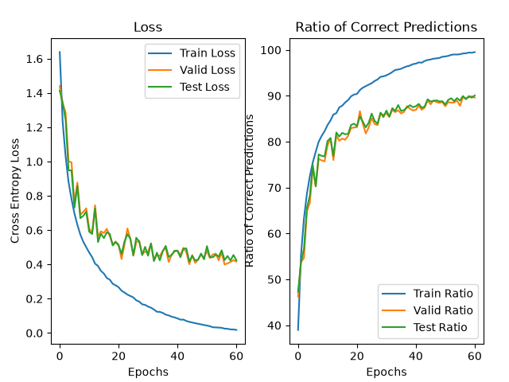
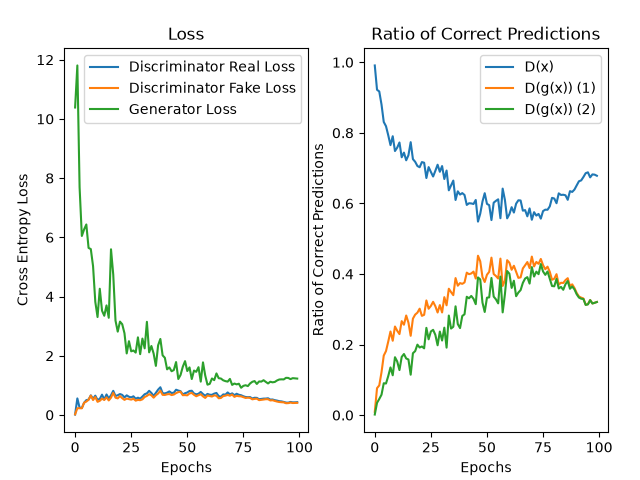

# DCGAN of OASIS Brain Dataset + Resnet18 on CIFAR10

## Resnet18 on CIFAR10

Resnet18 Model trained to do the CIFAR10 classification task. ~90% test set accuracy in under 30 minutes (or 10 if using mixed precision).

## DCGAN of OASIS Brain Dataset

Deep Convolutional Generative Adversarial Network trained to generate slices of the brain.
